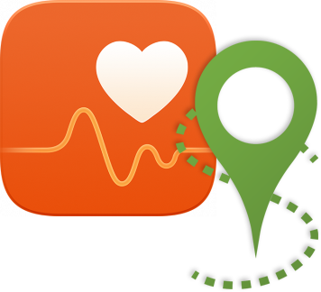

# Huawei Health activities to GPX

Golang app that generates GPX files from a Huawei HiTrack dump.

Hitrack data is what Huawei wearables generate after an activity ([Huawei Band 3 PRO](https://consumer.huawei.com/en/wearables/band3-pro/) is an example).

This app gets as input the HiTrack data from a Huawei Health app backup (as SQLite database).
The outputted `.GPX` files will contain timestamped GPS, altitude, heart-rate, and cadence data where available.

This app gets inspiration from [Huawei TCX Converter](https://github.com/aricooperdavis/Huawei-TCX-Converter) which should be used if your backup has a different format (see below).

## How to get the Huawei Health db

- Open the Huawei Health app and open the exercise that you want to convert to view it's trajectory. This ensures that its HiTrack file is generated.
- Download the [Huawei Backup App](https://play.google.com/store/apps/details?id=com.huawei.KoBackup&hl=en_GB) onto your phone.
- Start a new **unencrypted** backup of the Huawei Health app data to your external storage (SD Card)
- Connect the phone to the pc using a USB cable. When prompted on the phone, authorize the pc to access data.
- If you can see the phone as an external memory (like on Linux) navigate to `/HuaweiBackup/backupFiles/<backup folder>/` and copy `com.huawei.health.db` to your computer. If you can't find the `.db` file but you find the `com.huawei.health.tar` file, than you should use [Huawei TCX Converter](https://github.com/aricooperdavis/Huawei-TCX-Converter).
- If you're on a Mac you need to install the [HiSuite app](https://consumer.huawei.com/en/support/hisuite/) and use it to access the SD card on the phone. Then follow the same instructions as the point above.

## How to build and install

```
git clone git@github.com:tommyblue/huawei-health-to-gpx.git
./scripts/setup
./scripts/install
```

## How to run the app

The app can check the db and list the existing tracks:

```
hitrack2gpx ~/<path>/com.huawei.health.db
```

If an activity ID is provided, the app outputs the GPX file:

```
hitrack2gpx ~/<path>/com.huawei.health.db <ID>
```

The output can be saved to a file:

```
hitrack2gpx ~/<path>/com.huawei.health.db <ID> > ~/<path>/file.gpx
```

## Requirements

* [go-sqlite3](https://github.com/mattn/go-sqlite3)
